# SFWidgets

Collections of Custom Widgets and Experiments made in Python for PySide2

## Raytracer

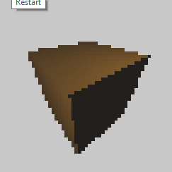

## Pathtracer 2D bouncing

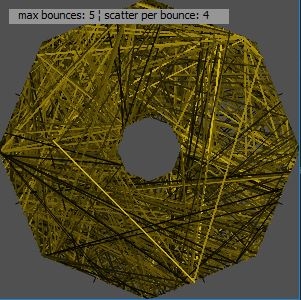

## Marching Squares

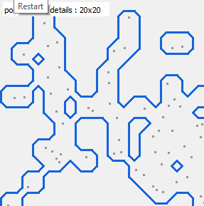

## Shadow Volumes

## Light Volumes

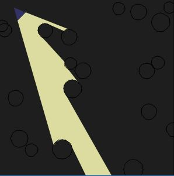

## Quadtree

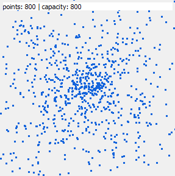

## Tree Colonization

## LTree

LSystem adjusted for tree generation.

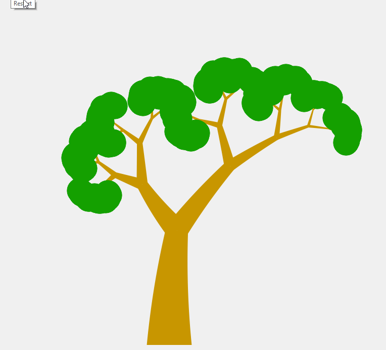

## LSystem

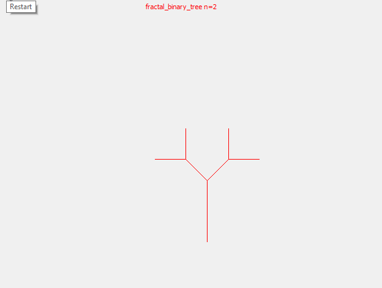

## Pythagoras Tree

## Mandelbrot

## Diamond Square

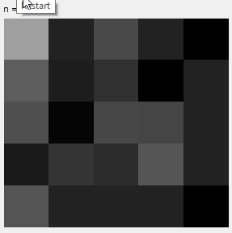

## Perlin Noise 2D

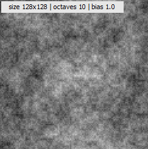

## Perlin Noise 1D

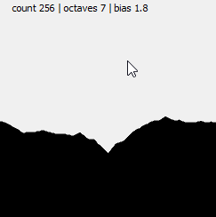

## Maze Depth First

## Snake

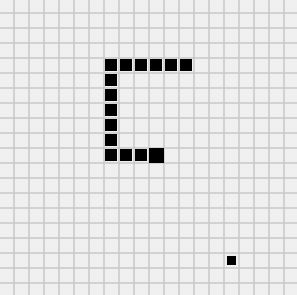

## Fibonacci Golden Ratio

## Rasterization

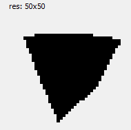

## Slider2DWidget

A two dimensional sliding system

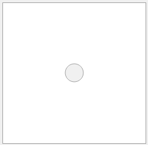
