# Labs Python

Collections of Experiments made in Python

## EvoLisa

Using Genetic Algorithm to Evolve Triangles to match an image

[Read More](projects/038_evolisa/evolisa.md)

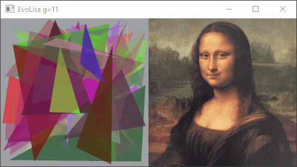

## Boids

Implementation of coordinated animal motion such as bird flocks and fish schools.
Based on Craig Reynolds concept.

[Read More](projects/039_boids/boids.md)

## Raytracer

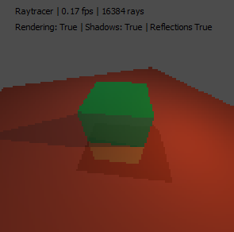

## Pathtracer 2D bouncing

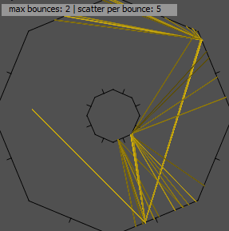

## Marching Squares

## Genetic Algorithm

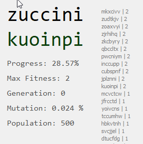

## Shadow Volumes

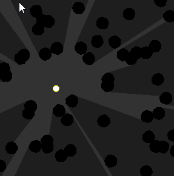

## Light Volumes

## Maze Solver

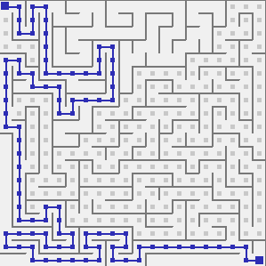

## Quadtree

## Tree Colonization

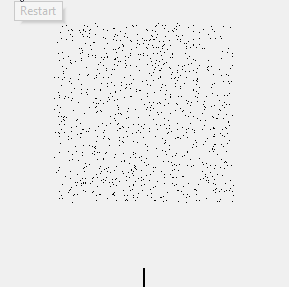

## LTree

LSystem adjusted for tree generation.

## LSystem

## Pythagoras Tree

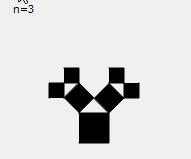

## Mandelbrot

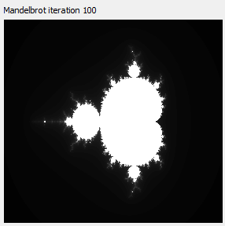

## Diamond Square

## Diffusion Limited Aggregation

## Perlin Noise 2D

## Perlin Noise 1D

## Maze Depth First

## Snake

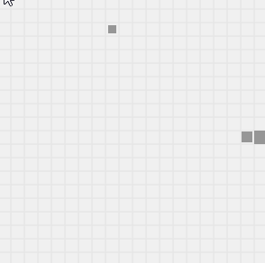

## Fibonacci Golden Ratio

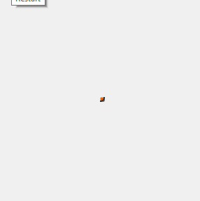

## Rasterization

## 10 PRINT

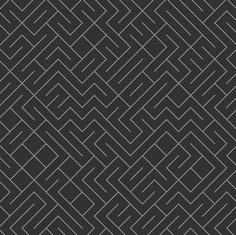

## Slider2DWidget

[Read More](projects/001_slider2d/README.md)

## Star Field

## Voronoi Diagram

## Random Walker

## Levy Flight

## Plotting Cos Sin Tan

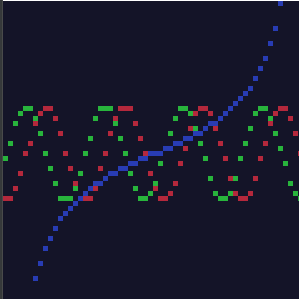
