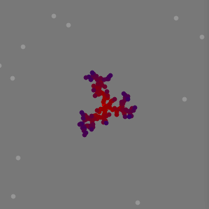
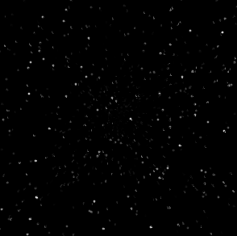
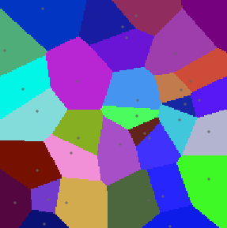
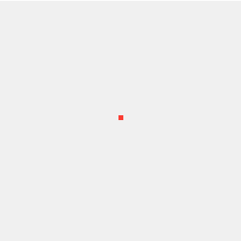

# SFWidgets

Collections of Custom Widgets and Experiments made in Python for PySide2

## Raytracer

## Pathtracer 2D bouncing

## Marching Squares

## Genetic Algorithm

## Shadow Volumes

## Light Volumes

## Maze Solver

## Quadtree

## Tree Colonization

## LTree

LSystem adjusted for tree generation.

## LSystem

## Pythagoras Tree

## Mandelbrot

## Diamond Square

## Diffusion Limited Aggregation

## Perlin Noise 2D

## Perlin Noise 1D

## Maze Depth First

## Snake

## Fibonacci Golden Ratio

## Rasterization

## 10 PRINT

## Slider2DWidget

## Star Field

## Voronoi Diagram

## Random Walker

## Levy Flight

## Plotting Cos Sin Tan

