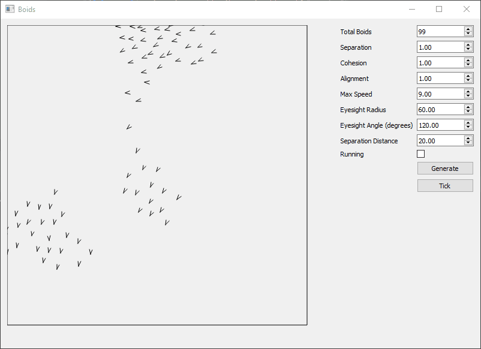
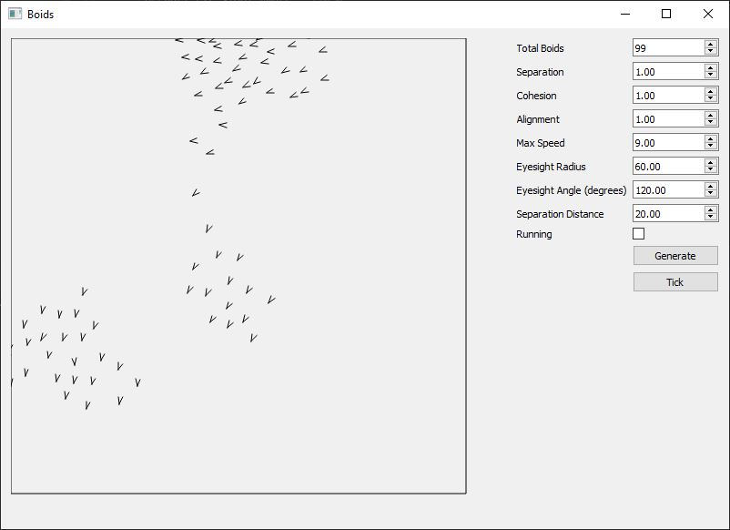

# Boids

Implementation of coordinated animal motion such as bird flocks and fish schools.
Based on Craig Reynolds concept.



## How to run

```commandline
python run_boids.py
```

Requirements:

* Python 3.7
* Pyside2

## Images



## Resources

* <http://www.red3d.com/cwr/boids/>
* <http://www.cs.toronto.edu/~dt/siggraph97-course/cwr87/>
* <http://www.kfish.org/boids/pseudocode.html>
